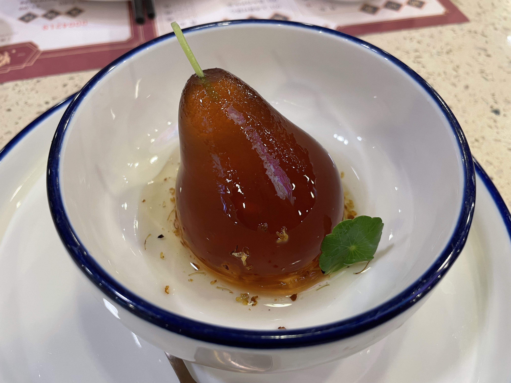
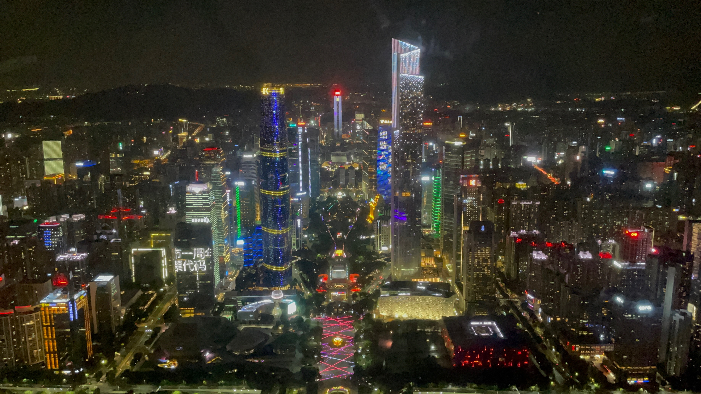
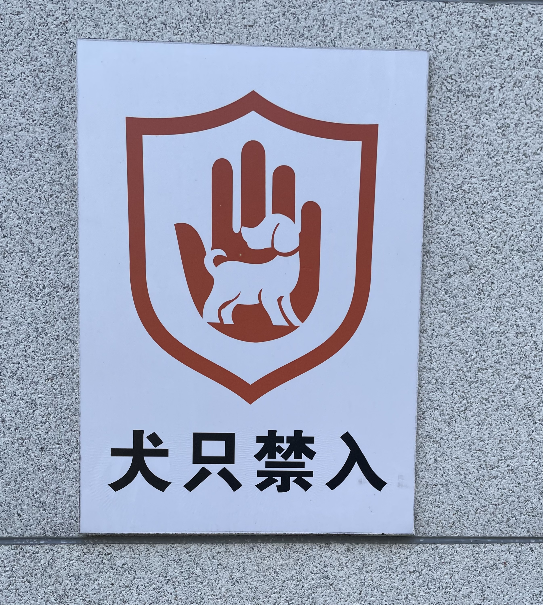

<iframe frameborder="no" border="0" marginwidth="0" marginheight="0" width=330 height=86 src="//music.163.com/outchain/player?type=2&id=1397345903&auto=0&height=66"></iframe>

```
「	我主张克制不了就放任
	悬上该有的天真
	起伏在于喜怒哀乐
	松了绳
	大不了无人问	」
```

欢迎来到广东～👏

虽然在深圳读了 3 年书了，但是一直都没有去过广州，虽然每年回家、去外地都要经过这里，去珠海也在这里转过几次车，但是这还是第一次正儿八经地到广州来玩。

在这期间听很多同学，也见过很多同学在广州的旅行。身边也不知道什么时候多了很多来自广州的同学，但是由于自己没有熟人在广州就一直没去。正好趁着你到广州来的契机，我也去看看，这个被许多同学说道，生活气息浓厚的城市，长成个什么样子。

晚上，将就着黄昏与夜色，背着小包，踏上了迎接你的路途。


还是在广东个人最喜欢的项目——点都德，很久没吃过了，虾饺还是一如既往的好吃，红米肠、肠粉和叉烧包…… 早上，漫步在去往公交站的路上，广州的马路并不像北京那样整齐划一，反而，横七竖八的街道，和岭南更加得相配。很少有那种时间，慢慢悠悠地吃早饭，周围都是谈恋爱的小情侣或者是说笑当中的娭毑。



<iframe frameborder="no" border="0" marginwidth="0" marginheight="0" width=330 height=86 src="//music.163.com/outchain/player?type=2&id=212409&auto=0&height=66"></iframe>

```
「	当天的笑声 依稀再次掠过
	丝丝的雨点 串起寂寞心窝
	风中的记忆 不断刺痛着我
	美丽故事 伤心结果	」
```

去吃了网红店的双皮奶，也吃了只有辣锅🌶️的海底捞😂，，可以说是非常的杂糅了。晚上去了广州的必打卡景点——广州塔，虽然广州塔很贵很贵，但是毕竟好不容易才来一次，想着再怎么也要上去看看。



走马观花似的旅途已经不是第一次了，想来曾经都是我自己觉得，去到一个地方最主要不是那有多好玩，而是陪你一起的是什么样的人，一个人的旅途对我而言，总是缺少了点意义的。很欣慰地发现，在很多年之后，也有一样的好朋友和我有了相同的感受。

下次，当你再踏入🛬️广东的时候，我们一定都会更好的吧。

