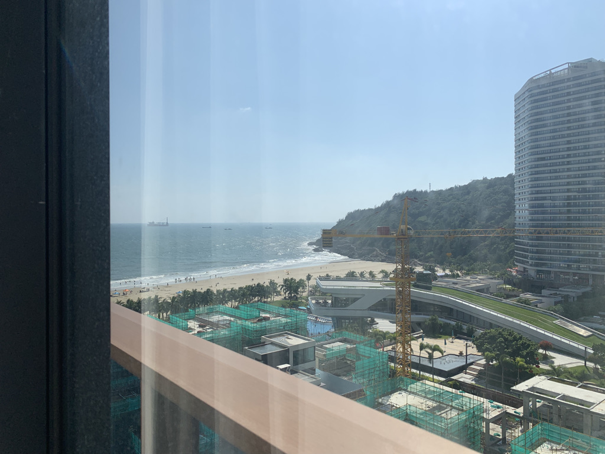
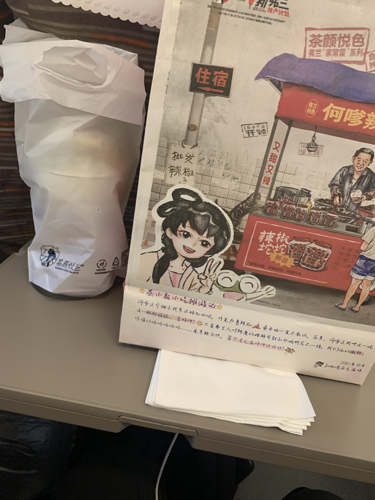
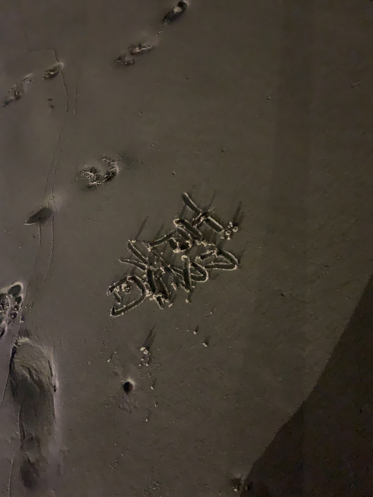

<iframe frameborder="no" border="0" marginwidth="0" marginheight="0" width=330 height=86 src="//music.163.com/outchain/player?type=2&id=26402859&auto=0&height=66"></iframe>

```
「	菩提落叶化泥尘（菩提落叶化泥尘，几度轮回几度人。）
	几度轮回几度人（众生殊出皆皓玉，因果浮屠孽海痕。）
	戏生新儿怡雏蝶（灵台皆空无我相，烦恼苦楚伤精神。）
	春意萌芽又相逢（清心净气映明镜，醍醐灌顶真法门。）

	百卷烦恼随风去（幽影空阙愁绵绵，红尘纷繁泪涟涟。）
	清净灵台燕留痕（造化如丝谁人剪，青灯黯弱苦少年。）
	收心御气映明镜（何种姻缘当挂牵，低诉心愿默默言。）
	才是自在真法门（书萧琴瑟皆乏倦，空心悟禅伴佛前。）	」
```

上一次到沙滩，是两年前的中秋，在大梅沙。我们很早很早就定好了房间，坐了很久很久的地铁，还挤了好多好多人的公交。



找了好久好久的酒店，吃了KFC的外卖，看了综艺；吃了第一次尊宝，喝了喜茶，走了沙滩，鞋子被潮水打湿，拖着带沙的鞋子走了好久。我们无意间到了废弃的老奥特莱斯，走在无人的小巷，三三俩俩的人们，找到了一座寂寥的桥，拍了好多照片。

半夜里，吃了简简单单的烧烤。一起看了一休，还有好多好多动画片……

<iframe frameborder="no" border="0" marginwidth="0" marginheight="0" width=330 height=86 src="//music.163.com/outchain/player?type=2&id=32689580&auto=0&height=66"></iframe>

```
「	甜蜜地与爱人风里飞奔
	高声欢呼你有情不枉这生
	一声你愿意一声我愿意
	惊天爱再没遗憾
	明月雾里照人相爱相亲
	让对对的恋人增添性感
	一些恋爱变恨
	更多恋爱故事动人
	划上了丝丝美感	」
```

感觉是对的人们，在对的时间，做了对的事情。



我坐在岸边想，能否有个浪头，将我冲下海去，把我带到本该属于我的地方。让我再次见见曾经的人们，哪怕只是站在他们的身边，听着他们寒暄，而我，就站在那儿，看着，就那样看着，心里都会是开心的吧。

我到了那，和那时的我想拥，热泪盈眶，告诉他：“一切都很好，一定要珍惜，拥抱周围的一切，就如同我拥抱你一样……”他也许会诧异，他也许早有预期，但都不重要。他身边的那个人，应该看不见我，而我看着她，对着曾经的我，说了半句：“我们去……”

<iframe frameborder="no" border="0" marginwidth="0" marginheight="0" width=330 height=86 src="//music.163.com/outchain/player?type=2&id=1414075953&auto=0&height=66"></iframe>

```
「	在缥缈的梦里 讨一夜空欢喜
	原是平生太过小心
	今岁他年 如何能轻许
	由来红尘不问别离

 	在同样故事里 或另一个结局
	唯恐日后被谁提及
	流萤流离 有多少相识都无意
	偏偏要人情难自禁	」
```



眼泪不争气地落了下来，“有点看不清了”，我擦了擦眼睛。

回到了岸上，沙子里进了眼睛，抱了抱自己，月亮晒着我……
